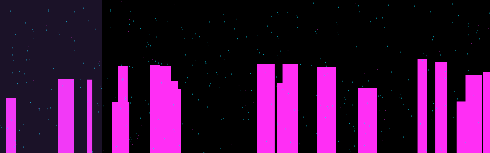
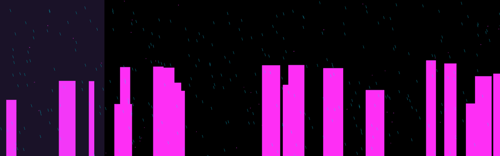

# ⟡ G N U J A S O N  
### _Cinematic Systems Engineer · Platform Steward · Audit‑Driven Architect_

## 🟣 Terminal Boot Sequence — `profile.sys/init`

> establishing uplink…
> verifying parallax layers… ok
> loading neon‑noir skyline… ok
> enabling weather loops… ok
> compiling identity modules… ok
> CMU_MSE_portfolio: mounted
> GrandmaGames_platform: online
> Pulse_of_Humanity: rendering
> status: ACTIVE

---

---

## 🟦 Who I Am (System Overview)

I’m **Jason**, a engineering student and platform steward specializing in:

- **audit‑driven refactoring**
- **deterministic restoration**
- **modular extraction**
- **cinematic UI/UX polish**
- **multi‑game platform hardening**
- **simulation‑driven product design**

My work spans **GrandmaGames**, **Pulse projects**, and **Wikirecipes.org**, where I lead system audits, platform migrations, and reproducible deployment pipelines.

I’m currently building a **portfolio** centered on:

- platform engineering  
- simulation systems  
- audit‑driven workflows  
- reproducible automation  
- cinematic, ambient computing experiences  

---

## 🟧 Current Mission: _Pulse of Humanity_

A universal, ambient, hover‑only screensaver experience:

- cinematic parallax skylines  
- procedural weather  
- soft‑interaction layers  
- global demographic storytelling  
- zero‑click immersion  

This repo’s neon‑noir engine is the prototype rendering pipeline.

---

### **Audit Everything**  
Every system tells a story. I read it, rewrite it, and make it reproducible.

### **Deterministic > Clever**  
If I can’t rebuild it from scratch, it’s not done.

### **Cinematic UI/UX**  
Interfaces should feel like scenes, not screens.

### **Platform Stewardship**  
I don’t just build features — I maintain ecosystems.

---

Frontend:   React · React Native · D3 · Three.js
Backend:    FastAPI · Node · Python
Systems:    GitHub Actions · CI/CD · Docker · WSL
Graphics:   Pillow · Canvas · FFmpeg · ImageMagick
Philosophy: Audit-driven engineering · Deterministic workflows

---

### **⟡ GrandmaGames Platform**
Multi‑game ecosystem with shared UI/UX, modular engines, and audit‑driven refactors.

### **⟡ Pulse of Humanity**
Cinematic demographic visualization + ambient computing experience.

### **⟡ Wikirecipes.org**
Community‑driven recipe platform with structured data and clean editorial tooling.

---

---

---

---

## 🟤 Contact / Uplink

- **GitHub:** @GnuJason  
- **Location:** Charleston, SC  
- **Focus:** CMU MSE · Platform Engineering · Simulation Systems  

---

### _“Systems are stories. I make them cinematic.”_

