<picture>
  <source media="(prefers-reduced-motion: reduce)" srcset="assets/banners/bunker-engineer.png">
  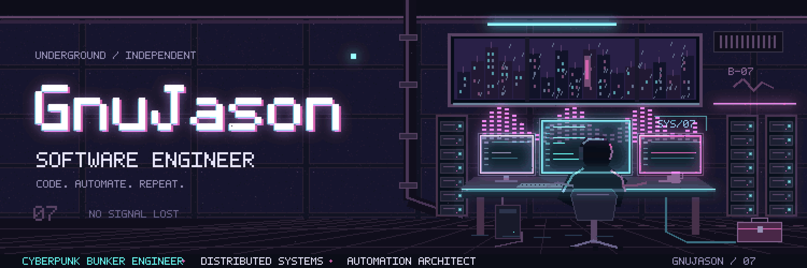
</picture>

<h1 align="center">GnuJason — Software Engineer</h1>

<p align="center">
  <b>Cyberpunk Bunker Engineer • Distributed Systems • Automation Architect</b>
</p>

<div align="center">
  <picture>
    <source media="(prefers-reduced-motion: reduce)" srcset="assets/animations/bunker-typing.png">
    
  </picture>
  <p>
    <a href="#operator-log">Operator Log</a> &nbsp; / &nbsp;
    <a href="#project-bays">Project Bays</a> &nbsp; / &nbsp;
    <a href="#toolchain">Toolchain</a> &nbsp; / &nbsp;
    <a href="https://github.com/GnuJason?tab=repositories">All Repositories</a>
  </p>
</div>

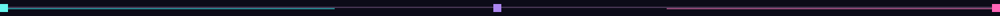

<h2 id="operator-log">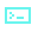 01 / Operator Log</h2>

I'm Jason. I build tools that turn complex systems into something you can see, understand, and work with: real-time telemetry, open-data visualizations, command-line utilities, and pixel-art tooling.

My interests live where **distributed systems**, **automation**, and **creative engineering** meet. Terminal-first when it makes sense. Visual when it makes a difference.

```text
operator  : GnuJason
sector    : software engineering
focus     : distributed systems / automation
workbench : telemetry / open data / developer tools
```


<h2 id="project-bays">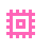 02 / Project Bays</h2>

<p align="center">
  <a href="https://github.com/GnuJason/F1">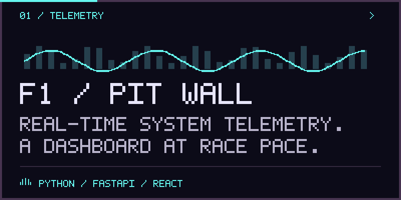</a>
  <a href="https://github.com/GnuJason/geome">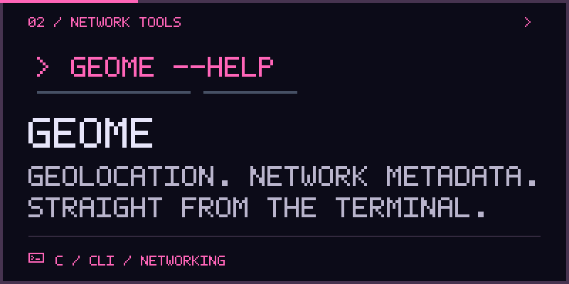</a>
  <a href="https://github.com/GnuJason/Pulse-of-Humanity">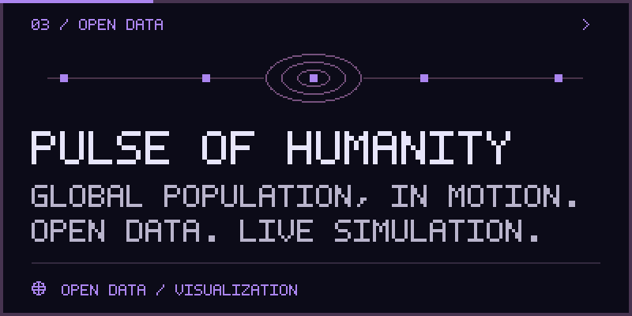</a>
  <a href="https://github.com/GnuJason/spratforge">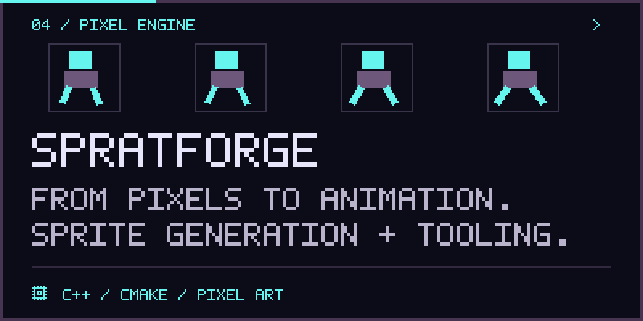</a>
</p>

<p align="center">
  <a href="https://pulseofhumanity.org">Pulse of Humanity / Live</a> &nbsp; • &nbsp;
  <a href="https://www.pulseofkorea.org/">Pulse of Korea / Live</a> &nbsp; • &nbsp;
  <a href="https://github.com/GnuJason?tab=repositories">Explore the Workbench →</a>
</p>


<h2 id="toolchain">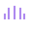 03 / Toolchain</h2>

<p align="center">
  
  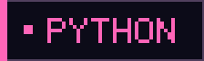
  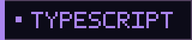
  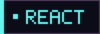
  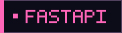
  
  
  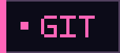
</p>

**Systems & tools** · C, C++, Python, Linux, Git, CMake

**Interfaces & data** · TypeScript, React, D3, FastAPI, WebSockets


<h2 id="open-channel"> 04 / Open Channel</h2>

Interested in real-time systems, useful automation, or the space between code and art? Explore a repository, open an issue, or bring a pull request.

<p align="center">
  <a href="https://github.com/GnuJason">GitHub / GnuJason</a> &nbsp; • &nbsp;
  <a href="https://github.com/GnuJason?tab=overview#js-contribution-activity">Contribution Log</a> &nbsp; • &nbsp;
  <a href="https://github.com/GnuJason/GnuJason/issues">Start a Conversation</a>
</p>

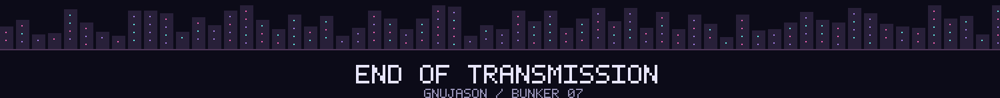
